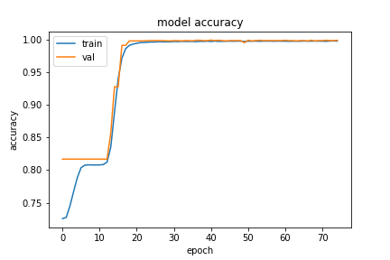
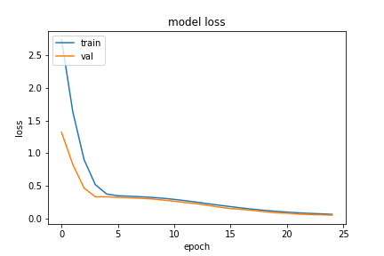
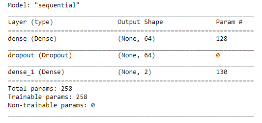
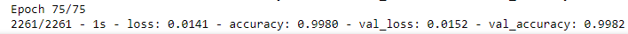
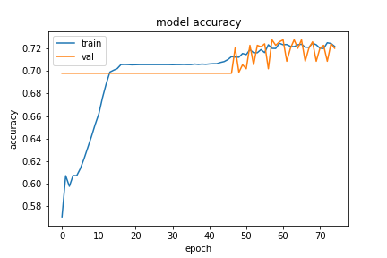
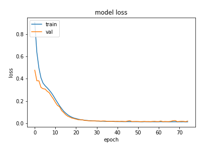
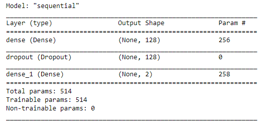
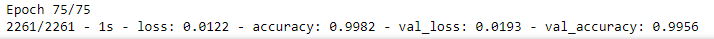

## Using Smartphone BLE RSSI Values to Classify Proximity with Deep Neural Networks

### Devices used

| Device      | Name                      | Model         |
| :---        |           :----:          |          ---: |
| D1          | Xiaomi Redmi Note 10 Pro  |  M2101K6G     |
| D2          | Xiaomi Redmi 9            | M2004J19C     |
| D3          | Nokia 5.1 Plus            | -     |
| D4          |  Nokia 2.3                | -     |

### 4 different scenarios
- [x] Data collection with Devices 3 feet apart in an indoor open space.
- [x] Data collection with Devices 9 feet apart in an indoor open space.
- [x] Data collection with Devices 3 feet apart with an interior wall in between.
- [x] Data collection with Devices 9 feet apart with an interior wall in between.

| Scenario  | Conditions                    | Target Classification |
|-----------|-------------------------------|--------|
| open3feet | - 3 feet apart   - Indoor space |    1   |
| open9feet | - 9 feet apart   - Indoor space  |    0   |
| wall9feet | - 3 feet apart   - Indoor wall in between  |    0   |
| wall9feet | - 9 feet apart   - Indoor wall in between  |    0   |

### Results:

| Hidden layer size   | 1 Dense Layers      | model     | model description     |
|:---------------------:|:---------------------:| :------:|  :------:|
| Hidden layer size 64|     | |  |
| Hidden layer size 128|     | |   |

